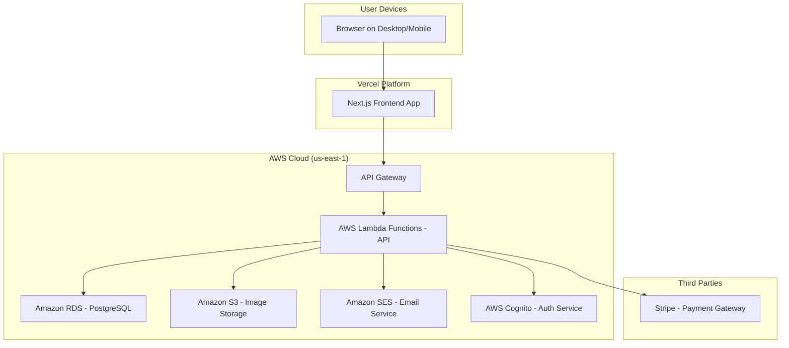
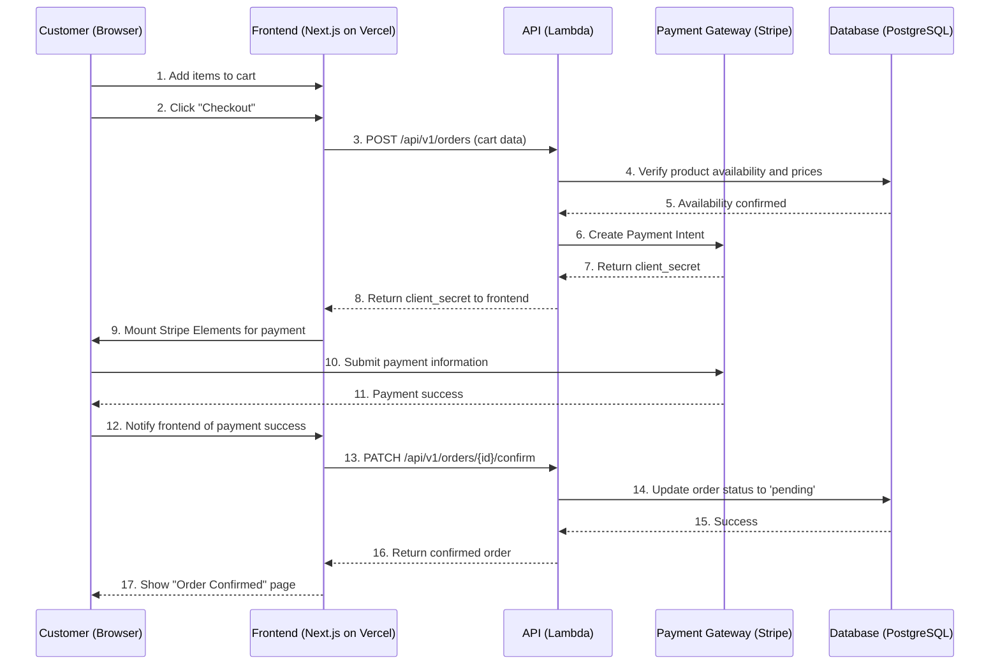

# Farm Market Fullstack Architecture Document

### 1. Introduction

This document outlines the complete fullstack architecture for the Farm Market application, including backend systems, frontend implementation, and their integration. It serves as the single source of truth for AI-driven development, ensuring consistency across the entire technology stack. This unified approach streamlines the development process for modern fullstack applications where these concerns are increasingly intertwined.

#### **Starter Template or Existing Project**

N/A - This is a greenfield project. The architecture and code will be created from scratch based on the PRD.

#### **Change Log**

| Date | Version | Description | Author |
| :--- | :--- | :--- | :--- |
| 2025-09-18 | 0.1 | Initial draft of Architecture document. | Winston (Architect) |

***

### 2. High Level Architecture

#### **Technical Summary**

The Farm Market application will be a **Modular Monolith** deployed in a serverless-oriented environment, using a **TypeScript-based monorepo** to share code between a **React (Next.js) frontend** and a **Node.js (Express) backend**. The architecture prioritizes rapid development and scalability, leveraging a **PostgreSQL** database for data integrity and a secure, third-party service for payments. The frontend will be a statically generated and server-side rendered application for performance, communicating with the backend via a **REST API**. This architecture directly supports the PRD's goals of simplicity, reliability, and scalability.

#### **Platform and Infrastructure Choice**

**Recommendation:** Vercel for the frontend and AWS for the backend.

*   **Option 1: Vercel (Frontend) + AWS Lambda/Fargate (Backend)**
    *   **Pros:** Best-in-class developer experience and performance for the Next.js frontend via Vercel. AWS provides robust, scalable, and secure infrastructure for the backend API and database. Clear separation of concerns.
    *   **Cons:** Involves managing two different platforms.
*   **Option 2: AWS-Only (Amplify + Lambda/Fargate)**
    *   **Pros:** Unified infrastructure and billing on a single provider. Deep integration with other AWS services.
    *   **Cons:** AWS Amplify can have a steeper learning curve and may be less optimized for Next.js specifically compared to Vercel.

**Decision:** We will proceed with **Option 1**.

*   **Platform:** Vercel (Frontend), AWS (Backend)
*   **Key Services:** Vercel (Hosting, CI/CD), AWS Lambda (API), AWS Fargate (potential for larger services), Amazon RDS for PostgreSQL (Database), Amazon S3 (File Storage), AWS Cognito (Authentication), Amazon SES (Email Notifications).
*   **Deployment Host and Regions:** Vercel (Global Edge Network), AWS (us-east-1 as primary region).

#### **Repository Structure**

*   **Structure:** Monorepo
*   **Monorepo Tool:** Turborepo
*   **Package Organization:**
    *   `apps/web`: The Next.js frontend application.
    *   `apps/api`: The Node.js/Express backend application.
    *   `packages/shared-types`: Shared TypeScript interfaces (e.g., for API responses, data models).
    *   `packages/ui`: Shared React components (e.g., buttons, form inputs).
    *   `packages/config`: Shared configurations (ESLint, TypeScript, etc.).

#### **High Level Architecture Diagram**



#### **Architectural Patterns**

- **Modular Monolith (Backend):** The backend will be a single deployable unit, but internally structured into modules based on domain (e.g., `users`, `products`, `orders`). _Rationale:_ This simplifies development and deployment for the MVP while allowing for future extraction into microservices if needed.
- **Component-Based UI (Frontend):** The frontend will be built as a collection of reusable React components. _Rationale:_ This promotes consistency, reusability, and maintainability of the user interface.
- **Repository Pattern (Backend):** Data access logic will be abstracted into a dedicated repository layer. _Rationale:_ This decouples the business logic from the data source, making the application easier to test and allowing for future database changes with minimal impact.
- **API Gateway (Backend):** All API requests will be routed through a single API Gateway. _Rationale:_ This provides a centralized location for handling authentication, rate limiting, and request routing.

***

### 3. Tech Stack

| Category | Technology | Version | Purpose | Rationale |
| :--- | :--- | :--- | :--- | :--- |
| Frontend Language | TypeScript | 5.x | Type safety for UI code | Reduces runtime errors and improves developer experience. |
| Frontend Framework | Next.js (React) | 14.x | Full-stack React framework | Provides excellent performance (SSG/SSR) and developer experience. |
| UI Component Library | Shadcn/UI | latest | Composable and accessible UI components | Provides a great-looking, unstyled base to build our custom UI upon. |
| State Management | Zustand | 4.x | Minimalist state management | Simple, unopinionated, and avoids boilerplate compared to Redux. |
| Backend Language | TypeScript | 5.x | Type safety for API code | Consistent language with frontend, reduces errors. |
| Backend Framework | Express.js | 4.x | Web server framework for Node.js | Mature, well-supported, and flexible for building REST APIs. |
| API Style | REST | N/A | Client-server communication | Well-understood, stateless, and easy to consume for web clients. |
| Database | PostgreSQL | 16.x | Primary data store | Robust, reliable, and excellent for relational data like users and orders. |
| File Storage | Amazon S3 | N/A | Storing user/product images | Highly scalable, durable, and cost-effective object storage. |
| Authentication | AWS Cognito / NextAuth.js | N/A | User authentication and management | Cognito provides a robust backend, NextAuth simplifies frontend integration. |
| Frontend Testing | Jest & React Testing Library | latest | Unit & Component testing | Industry standard for testing React applications. |
| Backend Testing | Jest & Supertest | latest | Unit & Integration testing | Jest for test running, Supertest for HTTP endpoint testing. |
| E2E Testing | Playwright | latest | End-to-end browser testing | Modern, reliable, and fast E2E testing framework. |
| Build/Bundler | Turborepo / Next.js | latest | Monorepo management and bundling | Turborepo for monorepo tasks, Next.js handles its own bundling. |
| CI/CD | Vercel & GitHub Actions | N/A | Continuous integration & deployment | Vercel for frontend, GitHub Actions for backend deployment pipeline. |
| Monitoring | Vercel Analytics & AWS CloudWatch | N-A | Performance and health monitoring | Vercel for frontend vitals, CloudWatch for backend logs and metrics. |

***

### 4. Data Models

These data models provide a TypeScript representation of the database schema. They are intended for use in the `packages/shared-types` directory to ensure type safety across the frontend and backend.

#### **Users & Profiles**

```typescript
// packages/shared-types/src/user.ts

export type UserRole = 'admin' | 'farmer' | 'customer';

export interface User {
  id: string; // UUID
  email: string;
  createdAt: Date;
  updatedAt: Date;
}

export interface UserProfile {
  userId: User['id'];
  firstName?: string;
  lastName?: string;
  phoneNumber?: string;
  avatarUrl?: string;
  // Farmer-specific
  farmName?: string;
  isVerified: boolean;
}

export interface UserAddress {
  id: string; // UUID
  userId: User['id'];
  addressLine1: string;
  addressLine2?: string;
  city: string;
  state: string;
  postalCode: string;
  country: string;
  isDefaultShipping: boolean;
}
```

#### **Products & Categories**

```typescript
// packages/shared-types/src/product.ts

export interface ProductCategory {
  id: number;
  name: string;
  description?: string;
  parentCategoryId?: number;
}

export interface Product {
  id: string; // UUID
  farmerId: User['id'];
  categoryId?: number;
  name: string;
  description?: string;
  createdAt: Date;
  updatedAt: Date;
}

export interface ProductVariant {
  id: string; // UUID
  productId: Product['id'];
  sku?: string;
  priceCents: number;
  currency: string; // e.g., 'USD'
  attributes: Record<string, any>; // e.g., { size: 'Large' }
}

export interface Inventory {
  variantId: ProductVariant['id'];
  quantityAvailable: number;
  updatedAt: Date;
}
```

#### **Orders & Payments**

```typescript
// packages/shared-types/src/order.ts

export type OrderStatus = 'pending_payment' | 'processing' | 'shipped' | 'delivered' | 'cancelled' | 'refunded';
export type PaymentStatus = 'pending' | 'succeeded' | 'failed';

export interface Order {
  id: string; // UUID
  customerId: User['id'];
  shippingAddressId?: string;
  totalPriceCents: number;
  status: OrderStatus;
  createdAt: Date;
  updatedAt: Date;
}

export interface OrderItem {
  id: string; // UUID
  orderId: Order['id'];
  variantId: ProductVariant['id'];
  quantity: number;
  priceAtPurchaseCents: number;
}

export interface Payment {
  id: string; // UUID
  orderId: Order['id'];
  amountCents: number;
  currency: string;
  status: PaymentStatus;
  paymentProvider?: string;
  providerPaymentId?: string;
  createdAt: Date;
  updatedAt: Date;
}
```

***

### 5. API Specification

A REST API will be used. The following is a high-level summary of the key resources. A full OpenAPI 3.0 specification will be generated as part of the development process.

**Base URL:** `/api/v1`

**Authentication:** JWT Bearer Tokens issued by Cognito will be required for all authenticated endpoints.

**Key Resources:**

*   **Users & Auth**
    *   `POST /auth/register`: Create a new user (farmer or customer).
    *   `POST /auth/login`: Authenticate and receive a JWT.
    *   `GET /users/me`: Get the profile of the currently logged-in user.
*   **Products**
    *   `GET /products`: Get a list of all products (public).
    *   `GET /products/{id}`: Get details for a single product (public).
    *   `POST /products`: Create a new product (farmer only).
    *   `PUT /products/{id}`: Update a product (farmer only, owner).
*   **Orders**
    *   `POST /orders`: Create a new order from a shopping cart (customer only).
    *   `GET /orders`: Get a list of orders for the current user (customer or farmer).
    *   `PATCH /orders/{id}`: Update an order's status (farmer only, owner).

***

### 6. Core Workflows

#### **Place Order Sequence Diagram**


***

### 7. Database Schema

This schema is designed for scalability, clarity, and data integrity, separating concerns to provide a robust foundation for the application.

```sql
-- Drop existing types and tables to start fresh (for development environments)
DROP TABLE IF EXISTS order_items, order_status_history, orders, payments, inventory, product_variants, product_media, media, products, product_categories, user_addresses, user_roles, roles, user_profiles, users CASCADE;
DROP TYPE IF EXISTS user_role_enum, order_status_enum, payment_status_enum;

-- ========= Core Types =========
CREATE TYPE "user_role_enum" AS ENUM ('admin', 'farmer', 'customer');
CREATE TYPE "order_status_enum" AS ENUM ('pending_payment', 'processing', 'shipped', 'delivered', 'cancelled', 'refunded');
CREATE TYPE "payment_status_enum" AS ENUM ('pending', 'succeeded', 'failed');

-- ========= Users & Access Control =========
CREATE TABLE "users" (
  "id" uuid PRIMARY KEY DEFAULT gen_random_uuid(),
  "email" text UNIQUE NOT NULL,
  "password_hash" text NOT NULL,
  "created_at" timestamptz NOT NULL DEFAULT (now()),
  "updated_at" timestamptz NOT NULL DEFAULT (now()),
  "deleted_at" timestamptz
);
COMMENT ON TABLE "users" IS 'Core user accounts for authentication.';

CREATE TABLE "user_profiles" (
  "user_id" uuid PRIMARY KEY REFERENCES "users"("id") ON DELETE CASCADE,
  "first_name" text,
  "last_name" text,
  "phone_number" text,
  "avatar_url" text,
  "farm_name" text, -- Specific to farmers
  "is_verified" boolean NOT NULL DEFAULT false, -- Specific to farmers
  "updated_at" timestamptz NOT NULL DEFAULT (now())
);
COMMENT ON TABLE "user_profiles" IS 'Stores profile information for all users. Farmer-specific fields can be NULL for other roles.';

CREATE TABLE "roles" (
  "id" serial PRIMARY KEY,
  "name" user_role_enum UNIQUE NOT NULL
);
COMMENT ON TABLE "roles" IS 'Defines the available user roles in the system.';

CREATE TABLE "user_roles" (
  "user_id" uuid NOT NULL REFERENCES "users"("id") ON DELETE CASCADE,
  "role_id" integer NOT NULL REFERENCES "roles"("id") ON DELETE CASCADE,
  PRIMARY KEY ("user_id", "role_id")
);
COMMENT ON TABLE "user_roles" IS 'Assigns roles to users, allowing for multiple roles per user.';

CREATE TABLE "user_addresses" (
  "id" uuid PRIMARY KEY DEFAULT gen_random_uuid(),
  "user_id" uuid NOT NULL REFERENCES "users"("id") ON DELETE CASCADE,
  "address_line1" text NOT NULL,
  "address_line2" text,
  "city" text NOT NULL,
  "state" text NOT NULL,
  "postal_code" text NOT NULL,
  "country" text NOT NULL,
  "is_default_shipping" boolean NOT NULL DEFAULT false,
  "created_at" timestamptz NOT NULL DEFAULT (now())
);
COMMENT ON TABLE "user_addresses" IS 'Stores shipping or billing addresses for users.';

-- ========= Products & Inventory =========
CREATE TABLE "product_categories" (
  "id" serial PRIMARY KEY,
  "name" text UNIQUE NOT NULL,
  "description" text,
  "parent_category_id" integer REFERENCES "product_categories"("id")
);
COMMENT ON TABLE "product_categories" IS 'Allows for hierarchical categorization of products.';

CREATE TABLE "products" (
  "id" uuid PRIMARY KEY DEFAULT gen_random_uuid(),
  "farmer_id" uuid NOT NULL REFERENCES "user_profiles"("user_id"),
  "category_id" integer REFERENCES "product_categories"("id"),
  "name" text NOT NULL,
  "description" text,
  "created_at" timestamptz NOT NULL DEFAULT (now()),
  "updated_at" timestamptz NOT NULL DEFAULT (now()),
  "deleted_at" timestamptz
);
COMMENT ON TABLE "products" IS 'The core product entry, representing a type of good a farmer sells.';

CREATE TABLE "product_variants" (
  "id" uuid PRIMARY KEY DEFAULT gen_random_uuid(),
  "product_id" uuid NOT NULL REFERENCES "products"("id") ON DELETE CASCADE,
  "sku" text UNIQUE,
  "price_cents" integer NOT NULL CHECK ("price_cents" > 0),
  "currency" char(3) NOT NULL DEFAULT 'USD',
  "attributes" jsonb -- e.g., {"size": "Large", "unit": "dozen"}
);
COMMENT ON TABLE "product_variants" IS 'Represents a specific version of a product, e.g., by size or weight, which has a price and inventory.';

CREATE TABLE "inventory" (
  "variant_id" uuid PRIMARY KEY REFERENCES "product_variants"("id") ON DELETE CASCADE,
  "quantity_available" integer NOT NULL DEFAULT 0 CHECK ("quantity_available" >= 0),
  "updated_at" timestamptz NOT NULL DEFAULT (now())
);
COMMENT ON TABLE "inventory" IS 'Tracks the stock level for each individual product variant.';

-- ========= Media =========
CREATE TABLE "media" (
  "id" uuid PRIMARY KEY DEFAULT gen_random_uuid(),
  "file_url" text NOT NULL,
  "mime_type" text NOT NULL,
  "uploaded_by_user_id" uuid REFERENCES "users"("id"),
  "created_at" timestamptz NOT NULL DEFAULT (now())
);
COMMENT ON TABLE "media" IS 'Stores references to uploaded files, like product images.';

CREATE TABLE "product_media" (
  "product_id" uuid NOT NULL REFERENCES "products"("id") ON DELETE CASCADE,
  "media_id" uuid NOT NULL REFERENCES "media"("id") ON DELETE CASCADE,
  "display_order" smallint NOT NULL DEFAULT 0,
  PRIMARY KEY ("product_id", "media_id")
);
COMMENT ON TABLE "product_media" IS 'Links media files to products.';

-- ========= Orders & Payments =========
CREATE TABLE "orders" (
  "id" uuid PRIMARY KEY DEFAULT gen_random_uuid(),
  "customer_id" uuid NOT NULL REFERENCES "users"("id"),
  "shipping_address_id" uuid REFERENCES "user_addresses"("id"),
  "total_price_cents" integer NOT NULL,
  "status" order_status_enum NOT NULL DEFAULT 'pending_payment',
  "created_at" timestamptz NOT NULL DEFAULT (now()),
  "updated_at" timestamptz NOT NULL DEFAULT (now())
);
COMMENT ON TABLE "orders" IS 'Represents a single customer order.';

CREATE TABLE "order_items" (
  "id" uuid PRIMARY KEY DEFAULT gen_random_uuid(),
  "order_id" uuid NOT NULL REFERENCES "orders"("id") ON DELETE CASCADE,
  "variant_id" uuid NOT NULL REFERENCES "product_variants"("id"),
  "quantity" integer NOT NULL CHECK ("quantity" > 0),
  "price_at_purchase_cents" integer NOT NULL
);
COMMENT ON TABLE "order_items" IS 'A line item within an order.';

CREATE TABLE "order_status_history" (
  "id" uuid PRIMARY KEY DEFAULT gen_random_uuid(),
  "order_id" uuid NOT NULL REFERENCES "orders"("id") ON DELETE CASCADE,
  "status" order_status_enum NOT NULL,
  "changed_at" timestamptz NOT NULL DEFAULT (now()),
  "notes" text
);
COMMENT ON TABLE "order_status_history" IS 'Audit log for order status changes.';

CREATE TABLE "payments" (
  "id" uuid PRIMARY KEY DEFAULT gen_random_uuid(),
  "order_id" uuid NOT NULL REFERENCES "orders"("id"),
  "amount_cents" integer NOT NULL,
  "currency" char(3) NOT NULL DEFAULT 'USD',
  "status" payment_status_enum NOT NULL DEFAULT 'pending',
  "payment_provider" text, -- e.g., 'stripe'
  "provider_payment_id" text, -- ID from the payment provider
  "created_at" timestamptz NOT NULL DEFAULT (now()),
  "updated_at" timestamptz NOT NULL DEFAULT (now())
);
COMMENT ON TABLE "payments" IS 'Records payment transactions for orders.';

-- ========= Indexes for Performance =========
CREATE INDEX ON "user_profiles" ("user_id");
CREATE INDEX ON "user_roles" ("user_id", "role_id");
CREATE INDEX ON "user_addresses" ("user_id");
CREATE INDEX ON "products" ("farmer_id");
CREATE INDEX ON "products" ("category_id");
CREATE INDEX ON "product_variants" ("product_id");
CREATE INDEX ON "product_variants" ("sku");
CREATE INDEX ON "orders" ("customer_id");
CREATE INDEX ON "order_items" ("order_id");
CREATE INDEX ON "order_status_history" ("order_id");
CREATE INDEX ON "payments" ("order_id");

-- Trigger to automatically update 'updated_at' timestamps
CREATE OR REPLACE FUNCTION update_updated_at_column()
RETURNS TRIGGER AS $
BEGIN
   NEW.updated_at = now();
   RETURN NEW;
END;
$ language 'plpgsql';

-- Apply the trigger to tables
CREATE TRIGGER update_users_updated_at BEFORE UPDATE ON "users" FOR EACH ROW EXECUTE PROCEDURE update_updated_at_column();
CREATE TRIGGER update_user_profiles_updated_at BEFORE UPDATE ON "user_profiles" FOR EACH ROW EXECUTE PROCEDURE update_updated_at_column();
CREATE TRIGGER update_products_updated_at BEFORE UPDATE ON "products" FOR EACH ROW EXECUTE PROCEDURE update_updated_at_column();
CREATE TRIGGER update_inventory_updated_at BEFORE UPDATE ON "inventory" FOR EACH ROW EXECUTE PROCEDURE update_updated_at_column();
CREATE TRIGGER update_orders_updated_at BEFORE UPDATE ON "orders" FOR EACH ROW EXECUTE PROCEDURE update_updated_at_column();
CREATE TRIGGER update_payments_updated_at BEFORE UPDATE ON "payments" FOR EACH ROW EXECUTE PROCEDURE update_updated_at_column();
```

***

### 8. Unified Project Structure

```plaintext
farm-market/
├── apps/
│   ├── web/              # Next.js Frontend
│   │   ├── src/
│   │   └── package.json
│   └── api/              # Express.js Backend
│       ├── src/
│       └── package.json
├── packages/
│   ├── shared-types/     # Shared TypeScript interfaces
│   │   └── src/index.ts
│   ├── ui/               # Shared React components
│   │   └── src/
│   └── config/           # Shared configs (ESLint, etc.)
├── docs/
│   ├── prd.md
│   └── architecture.md
├── turborepo.json
└── package.json
```

***

## 9. Development Workflow

#### **Local Development Setup**
- **Prerequisites:** Node.js (v20+), Docker, Turborepo (`npm i -g turborepo`)
- **Initial Setup:**
  1. Clone the repository.
  2. Run `npm install` at the root.
  3. Run `docker-compose up -d` to start PostgreSQL.
  4. Copy `.env.example` to `.env` in `apps/api` and fill in database details.
- **Development Commands:**
  - `turbo dev`: Start all services.
  - `turbo test`: Run all tests.

***

This document provides a comprehensive architectural foundation. Further detailed design for each component will occur during the development sprints.
