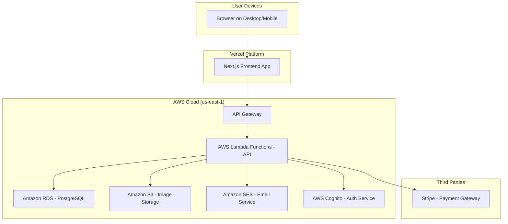

# 2. High Level Architecture

#### **Technical Summary**

The Farm Market application will be a **Modular Monolith** deployed in a serverless-oriented environment, using a **TypeScript-based monorepo** to share code between a **React (Next.js) frontend** and a **Node.js (Express) backend**. The architecture prioritizes rapid development and scalability, leveraging a **PostgreSQL** database for data integrity and a secure, third-party service for payments. The frontend will be a statically generated and server-side rendered application for performance, communicating with the backend via a **REST API**. This architecture directly supports the PRD's goals of simplicity, reliability, and scalability.

#### **Platform and Infrastructure Choice**

**Recommendation:** Vercel for the frontend and AWS for the backend.

*   **Option 1: Vercel (Frontend) + AWS Lambda/Fargate (Backend)**
    *   **Pros:** Best-in-class developer experience and performance for the Next.js frontend via Vercel. AWS provides robust, scalable, and secure infrastructure for the backend API and database. Clear separation of concerns.
    *   **Cons:** Involves managing two different platforms.
*   **Option 2: AWS-Only (Amplify + Lambda/Fargate)**
    *   **Pros:** Unified infrastructure and billing on a single provider. Deep integration with other AWS services.
    *   **Cons:** AWS Amplify can have a steeper learning curve and may be less optimized for Next.js specifically compared to Vercel.

**Decision:** We will proceed with **Option 1**.

*   **Platform:** Vercel (Frontend), AWS (Backend)
*   **Key Services:** Vercel (Hosting, CI/CD), AWS Lambda (API), AWS Fargate (potential for larger services), Amazon RDS for PostgreSQL (Database), Amazon S3 (File Storage), AWS Cognito (Authentication), Amazon SES (Email Notifications).
*   **Deployment Host and Regions:** Vercel (Global Edge Network), AWS (us-east-1 as primary region).

#### **Repository Structure**

*   **Structure:** Monorepo
*   **Monorepo Tool:** Turborepo
*   **Package Organization:**
    *   `apps/web`: The Next.js frontend application.
    *   `apps/api`: The Node.js/Express backend application.
    *   `packages/shared-types`: Shared TypeScript interfaces (e.g., for API responses, data models).
    *   `packages/ui`: Shared React components (e.g., buttons, form inputs).
    *   `packages/config`: Shared configurations (ESLint, TypeScript, etc.).

#### **High Level Architecture Diagram**

#### **Architectural Patterns**

- **Modular Monolith (Backend):** The backend will be a single deployable unit, but internally structured into modules based on domain (e.g., `users`, `products`, `orders`). _Rationale:_ This simplifies development and deployment for the MVP while allowing for future extraction into microservices if needed.
- **Component-Based UI (Frontend):** The frontend will be built as a collection of reusable React components. _Rationale:_ This promotes consistency, reusability, and maintainability of the user interface.
- **Repository Pattern (Backend):** Data access logic will be abstracted into a dedicated repository layer. _Rationale:_ This decouples the business logic from the data source, making the application easier to test and allowing for future database changes with minimal impact.
- **API Gateway (Backend):** All API requests will be routed through a single API Gateway. _Rationale:_ This provides a centralized location for handling authentication, rate limiting, and request routing.

***