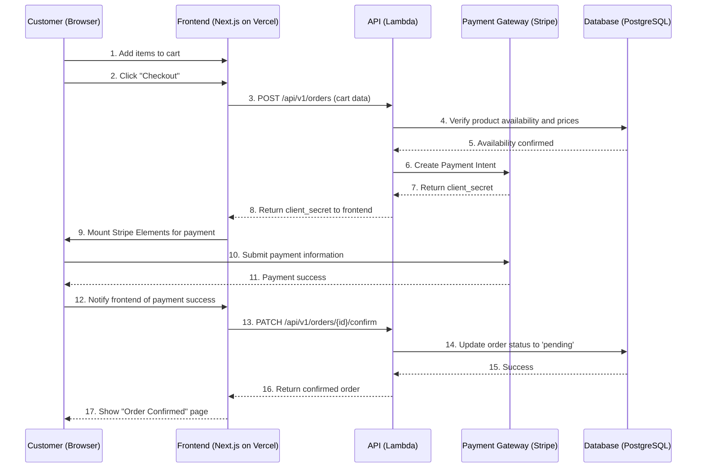

# 6. Core Workflows

#### **Place Order Sequence Diagram**

```mermaid
sequenceDiagram
    participant C as Customer (Browser)
    participant F as Frontend (Next.js on Vercel)
    participant A as API (Lambda)
    participant P as Payment Gateway (Stripe)
    participant DB as Database (PostgreSQL)

    C->>F: 1. Add items to cart
    C->>F: 2. Click "Checkout"
    F->>A: 3. POST /api/v1/orders (cart data)
    A->>DB: 4. Verify product availability and prices
    DB-->>A: 5. Availability confirmed
    A->>P: 6. Create Payment Intent
    P-->>A: 7. Return client_secret
    A-->>F: 8. Return client_secret to frontend
    F->>C: 9. Mount Stripe Elements for payment
    C->>P: 10. Submit payment information
    P-->>C: 11. Payment success
    C->>F: 12. Notify frontend of payment success
    F->>A: 13. PATCH /api/v1/orders/{id}/confirm
    A->>DB: 14. Update order status to 'pending'
    DB-->>A: 15. Success
    A-->>F: 16. Return confirmed order
    F-->>C: 17. Show "Order Confirmed" page
```

***